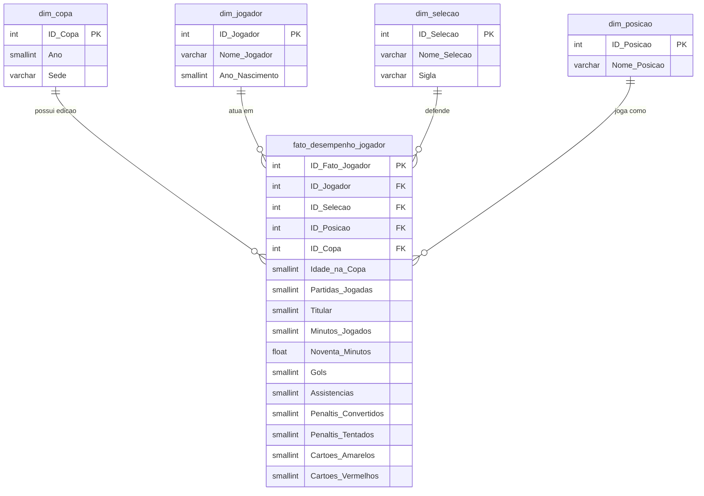

# 🐊 IAligator — Inteligência Artificial & Data Warehouse da Copa do Mundo

<div align="center">

  

  <p align="center">
    <strong>Seu assistente inteligente de ponta a ponta sobre a história das Copas do Mundo FIFA (1930 – 2022).</strong>
  </p>

  <p align="center">
    <a href="#-visão-geral">Visão Geral</a> •
    <a href="#-principais-recursos">Recursos</a> •
    <a href="#-arquitetura-do-sistema">Arquitetura</a> •
    <a href="#-data-warehouse-esquema-estrela">Data Warehouse</a> •
    <a href="#-dashboard-power-bi">Power BI</a> •
    <a href="#-cascata-de-ias-e-resiliência">Cascata de IAs</a> •
    <a href="#-instalação-e-execução">Como Rodar</a> •
    <a href="#-rotas-da-api">API</a>
  </p>

  <p align="center">
    
    
    
    
    
    
  </p>
</div>

---

## 📖 Visão Geral

O **IAligator** é uma solução completa que une **Engenharia de Dados (Data Warehouse Dimensional)**, **Business Intelligence (Power BI)** e **Inteligência Artificial Generativa (LLMs com Fallback Multi-Provedor e RAG Text-to-SQL)** para explorar e responder qualquer questão sobre a história completa das **Copas do Mundo FIFA (1930 a 2022)**.

O projeto elimina a barreira técnica entre bases de dados relacionais e o usuário comum: através de uma interface de chat conversacional moderna e temática, qualquer pessoa pode fazer perguntas em linguagem natural — como *"Quem foi o maior artilheiro de 1970?"*, *"Qual o jogador mais jovem a marcar em uma Copa?"* ou *"Quantos cartões a Argentina tomou em 2022?"* — e receber respostas precisas, fundamentadas estritamente em dados auditáveis, em milissegundos.

---

## 🌟 Principais Recursos

- 🏆 **Cobertura Histórica Abrangente**: Mais de 90 anos de mundiais (1930 a 2022), contemplando mais de **6.270 jogadores**, **todas as seleções participantes**, sedes, partidas, minutagem, gols, assistências e disciplina.
- ⚡ **Orquestração Multi-LLM Resiliente**:
  - Cascata com 3 modelos de ponta do Google Gemini (`gemini-3.6-flash` ➔ `gemini-3.5-flash` ➔ `gemini-3.5-flash-lite`).
  - Rotação dinâmica de múltiplas chaves de API (`GEMINI_API_KEY` + pool de reservas).
  - Contingência automática via **OpenRouter** para **NVIDIA Nemotron 3 Ultra 550B**.
  - Cache em memória com TTL de 5 minutos para respostas instantâneas sem consumo de quota.
- 🏷️ **Transparência de IA (Badges Dinâmicos)**: A interface exibe em tempo real qual motor de inteligência artificial gerou cada resposta (Gemini ou NVIDIA Nemotron).
- 🛡️ **Anti-Alucinação & RAG Determinístico**: A IA responde baseada no contexto extraído do banco MySQL; perguntas fora do escopo ou dados inexistentes são tratados com respostas controladas.
- 📊 **Dashboard Analítico Power BI Integrado**: Arquivos `.pbit` e `.pdf` prontos com métricas executivas, pirâmides etárias de artilharia, cartões por país e rankings consolidados.
- 🔌 **Tolerância a Falhas e Auto-Porta**: Inicialização com busca automática por portas disponíveis caso a padrão esteja ocupada (3001, 3002, 3003...).

---

## 🏗️ Arquitetura do Sistema

```mermaid
flowchart TD
    User([👤 Usuário]) <--> UI[💻 Chat Interface - HTML5 / CSS3 / JS]
    UI <-->|POST /api/chat| Server[🚀 Node.js Express Backend]

    subgraph Core ["Processamento & Resolução"]
        Server --> NLP[🔍 Extrator Semântico & Normalizador]
        NLP -->|SQL Dinâmico| DB[(🗄️ MySQL Data Warehouse\ndwcopa)]
        DB -->|Contexto JSON| Grounding[🧩 Grounding & Prompt Builder]
    end

    subgraph Intelligence ["Pipeline de Inferência Resiliente"]
        Grounding --> Cache{⚡ Cache Hit?}
        Cache -- Sim --> Response[💬 Resposta Formatada + Badge]
        Cache -- Não --> GeminiPool[✨ Google Gemini Cascade]
        
        GeminiPool -->|gemini-3.6-flash| G1[Gemini 3.6 Flash]
        GeminiPool -. Falha / Rate Limit .->|gemini-3.5-flash| G2[Gemini 3.5 Flash]
        GeminiPool -. Falha / Rate Limit .->|gemini-3.5-flash-lite| G3[Gemini 3.5 Lite]
        
        GeminiPool -. Todas as chaves esgotadas .-> OpenRouter[🟢 OpenRouter SDK]
        OpenRouter --> Nemotron[NVIDIA Nemotron 3 Ultra 550B]
        
        G1 --> Response
        G2 --> Response
        G3 --> Response
        Nemotron --> Response
    end

    Response --> UI
```

---

## 🗄️ Data Warehouse (Esquema Estrela)

O banco de dados relacional foi modelado no padrão dimensional **Star Schema** sob o database `dwcopa`, garantindo alta performance analítica e facilidade de junção:



### Principais Dimensões e Fatos:
| Tabela | Descrição | Registros / Destaques |
| :--- | :--- | :--- |
| `dim_copa` | Edições das Copas do Mundo | 22 edições (1930 a 2022), anos e sedes oficiais |
| `dim_jogador` | Atletas convocados na história | Mais de 6.270 atletas catalogados com ano de nascimento |
| `dim_selecao` | Países e representações nacionais | Todas as seleções históricas (incluindo Iugoslávia, União Soviética, etc.) |
| `dim_posicao` | Posições táticas em campo | FW (Atacante), MF (Meio-campo), DF (Defensor), GK (Goleiro) e compostas |
| `fato_desempenho_jogador` | Fatos de desempenho individual | Mais de 7.800 linhas com gols, assistências, minutos, titularidade e faltas |

---

## 📊 Dashboard Power BI

O repositório acompanha um painel analítico interativo completo desenvolvido no Power BI:
- 📁 **Modelo Parametrizado**: [`Dashboard IAligator.pbit`](Dashboard%20IAligator.pbit)
- 📑 **Relatório Exportado**: [`Dashboard IAligator.pdf`](Dashboard%20IAligator.pdf)

### Principais Visões Analíticas:
1. **Painel Geral de Estatísticas**:
   - Ranking histórico dos maiores artilheiros (Ronaldo Fenômeno, Gerd Müller, Klose, Just Fontaine, Mbappé).
   - Volume histórico de gols por seleção (Brasil, Alemanha, Argentina, França, Itália).
   - Curva etária de produtividade (gols marcados x idade dos atletas, demonstrando o ápice físico entre 24 e 27 anos).
   - Evolução da média de idade dos elencos ao longo das décadas.
   - Histórico de gols totais marcados por edição do torneio.
2. **Matriz Detalhada de Atletas**:
   - Cruzamento granular por edição, seleção, idade, minutos disputados, pênaltis e cartões disciplinares.

---

## 🤖 Cascata de IAs e Resiliência

Para contornar os rígidos limites de taxa (Rate Limits 429) e eventuais indisponibilidades de provedores em nuvem, o **IAligator** adota uma arquitetura em 4 camadas:

```
[Requisição do Usuário]
         │
         ▼
 1. Cache em Memória (TTL 5 min) ────── (Hit) ───> Retorna Imediato (0ms)
         │ (Miss)
         ▼
 2. Google Gemini Cascade
    ├── gemini-3.6-flash (Chave Primária)
    ├── gemini-3.5-flash (Chave Primária)
    ├── gemini-3.5-flash-lite (Chave Primária)
    └── [Se 429/503] ➔ Repete sequência com Chaves de Contingência
         │ (Falha geral)
         ▼
 3. OpenRouter Contingency
    └── NVIDIA Nemotron-3 Ultra 550B (API Secundária)
         │ (Falha)
         ▼
 4. Modo Local Seguro (Resumo tabular direto sem LLM)
```

Na interface, badges estilizados indicam com precisão se a inferência veio do ecossistema Google Gemini ou do motor NVIDIA Nemotron.

---

## 🚀 Instalação e Execução

### Pré-requisitos
- [Node.js](https://nodejs.org/) (versão 18 ou superior)
- [MySQL Server](https://dev.mysql.com/downloads/) (versão 8.0 ou superior)
- [Git](https://git-scm.com/)

### 1. Clonar o Repositório
```bash
git clone https://github.com/Nilokrtz/IAligator.git
cd IAligator
```

### 2. Restaurar o Banco de Dados MySQL
Importe o arquivo [`DWCopaPovoado.sql`](DWCopaPovoado.sql) no seu servidor MySQL:
```bash
mysql -u root -p < DWCopaPovoado.sql
```
> O script criará o banco de dados `dwcopa` já estruturado e totalmente povoado.

### 3. Instalar Dependências
```bash
npm install
```

### 4. Configurar as Variáveis de Ambiente
Crie um arquivo `.env` na raiz do projeto baseado no [`.env.example`](.env.example):
```env
PORT=3001
DB_HOST=localhost
DB_PORT=3306
DB_USER=root
DB_PASSWORD=sua_senha_mysql
DB_NAME=dwcopa

# Chaves Gemini (chave principal e reservas separadas por vírgula)
GEMINI_API_KEY=AIzaSy...
GEMINI_API_KEYS=chave_reserva1,chave_reserva2

# Chave OpenRouter (fallback secundário)
OPENROUTER_API_KEY=sk-or-v1-...
```

### 5. Iniciar a Aplicação
```bash
# Modo Produção
npm start

# Modo Desenvolvimento (com hot-reload)
npm run dev
```

Abra o seu navegador e acesse:
```
http://localhost:3001
```

---

## 💬 Exemplos de Perguntas para Testar

Experimente fazer perguntas em linguagem natural como:

- ⚽ *"Quem foi o artilheiro da Copa de 2002?"*
- 🎯 *"Quais são os 5 maiores artilheiros da história das Copas?"*
- 🟨 *"Qual seleção levou mais cartões amarelos em 2022?"*
- 👶 *"Quem foi o jogador mais jovem a participar de uma Copa?"*
- 👴 *"Quem é o jogador mais velho da história dos mundiais?"*
- 🌍 *"Onde foram realizadas as Copas de 1970 e 1994?"*
- ⏱️ *"Quem jogou mais minutos na Copa de 2018?"*

---

## 🛠️ Tecnologias Utilizadas

| Camada | Tecnologia | Finalidade |
| :--- | :--- | :--- |
| **Frontend** | HTML5, CSS3 Moderno, JavaScript ES6+ | Interface conversacional reativa com badges SVG dinâmicos |
| **Backend** | Node.js, Express.js | API RESTful, normalização léxica e orquestração de chamadas |
| **Banco de Dados** | MySQL, mysql2/promise | Data Warehouse Star Schema otimizado para consultas analíticas |
| **IA Principal** | Google GenAI SDK (`@google/genai`) | Modelos Gemini 3.6 Flash, 3.5 Flash e 3.5 Flash Lite |
| **IA Contingência** | OpenRouter SDK (`@openrouter/sdk`) | Modelo NVIDIA Nemotron 3 Ultra 550B para alta disponibilidade |
| **BI & Analytics** | Microsoft Power BI Desktop | Modelagem analítica, relatórios visuais e KPIs esportivos |

---

## 🛣️ Rotas da API

### `GET /`
Renderiza a aplicação web do chat (`main.html`).

### `GET /health`
Verifica a saúde do serviço:
```json
{
  "ok": true,
  "message": "API funcionando"
}
```

### `POST /api/chat`
Envia uma pergunta do usuário para resolução:
- **Body**:
  ```json
  {
    "question": "Quantos gols o Ronaldo fez em 2002?"
  }
  ```
- **Response**:
  ```json
  {
    "answer": "Ronaldo marcou 8 gols na Copa do Mundo de 2002.",
    "model": "gemini-3.6-flash",
    "provider": "gemini",
    "question": "Quantos gols o Ronaldo fez em 2002?",
    "context": [...]
  }
  ```

---

## 📂 Estrutura de Arquivos

```text
IAligator/
├── assets/
│   └── logo.png              # Ativos gráficos do mascote
├── css/
│   └── styles.css            # Estilos auxiliares
├── Dashboard IAligator.pbit  # Modelo de relatório parametrizado do Power BI
├── Dashboard IAligator.pdf   # Exportação visual completa do Dashboard Power BI
├── DWCopaPovoado.sql         # Dump completo do Data Warehouse dwcopa
├── logo.png                  # Logotipo principal do IAligator
├── main.html                 # Estrutura da interface do chat
├── package.json              # Metadados e dependências do projeto Node.js
├── README.md                 # Documentação oficial do projeto
├── script.js                 # Lógica do cliente, consumo da API e renderização de badges
├── server.js                 # Servidor Express, NLP, consultas SQL e cascata de IA
├── styles.css                # Estilos visuais e temas da interface
├── .env.example              # Modelo de configuração das variáveis de ambiente
└── .gitignore                # Regras de exclusão do Git
```

---

<div align="center">
  <sub>Desenvolvido com 💚 e paixão por futebol, engenharia de dados e inteligência artificial.</sub>
</div>
