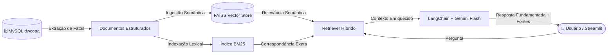
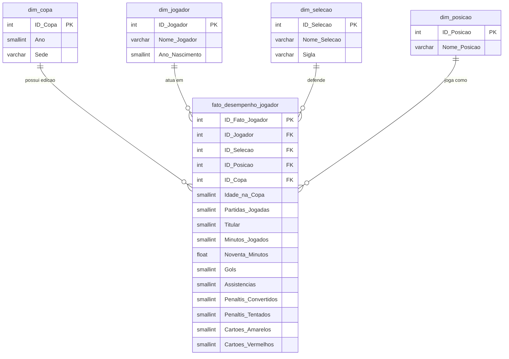

# 🐊 IAligator — Inteligência Artificial, RAG & Data Warehouse da Copa do Mundo

<div align="center">

  

  <p align="center">
    <strong>Seu ecossistema analítico inteligente sobre a história completa das Copas do Mundo FIFA (1930 – 2022).</strong>
  </p>

  <p align="center">
    <a href="#-visão-geral">Visão Geral</a> •
    <a href="#-duas-modalidades-de-uso">Modalidades</a> •
    <a href="#-arquitetura-do-sistema">Arquiteturas</a> •
    <a href="#-data-warehouse-esquema-estrela">Data Warehouse</a> •
    <a href="#-dashboard-power-bi">Power BI</a> •
    <a href="#-como-executar-o-projeto">Como Rodar</a> •
    <a href="#-rotas-da-api--cli">API & CLI</a>
  </p>

  <p align="center">
    
    
    
    
    
    
    
    
    
  </p>
</div>

---

## 📖 Visão Geral

O **IAligator** é uma plataforma que integra **Engenharia de Dados (Data Warehouse Dimensional)**, **Business Intelligence (Power BI)** e **Inteligência Artificial Generativa (RAG Híbrido e Fallback Multi-Provedor)** para responder instantaneamente qualquer dúvida histórica sobre todas as edições da **Copa do Mundo da FIFA (1930 a 2022)**.

O projeto oferece suporte a mais de **90 anos de futebol**, cobrindo **22 edições**, **mais de 6.270 jogadores convocados**, todas as seleções participantes, gols, assistências, minutagem, penalidades e registros disciplinares.

---

## 🔄 Duas Modalidades de Uso

O projeto foi projetado com duas frentes complementares de utilização:

| Recurso | 🌐 Modo Web & API (Node.js) | 🧠 Modo RAG Híbrido (Python) |
| :--- | :--- | :--- |
| **Interface** | Chat Web moderno com badges dinâmicos de IA | Dashboard reativo em Streamlit (`app.py`) |
| **Backend** | Node.js + Express.js (`server.js`) | Python + LangChain (`src/rag_chain.py`) |
| **Recuperação de Dados** | Tradutor semântico NLP + consultas SQL diretas | Busca Híbrida: **FAISS Vetorial** + **BM25 Lexical** |
| **Embeddings** | — | `sentence-transformers/all-MiniLM-L6-v2` |
| **Modelos de IA** | Cascata Gemini (3.6 / 3.5) + Fallback NVIDIA Nemotron | Google Gemini (3.8 Flash, 3.6 Flash, 2.5 Flash Lite) |
| **Resiliência** | Cache em memória (TTL 5 min) + Rotação de chaves | Fallback automático entre 5 modelos Gemini |
| **BI & Analytics** | Template e relatório Power BI (`.pbit` / `.pdf`) | Fontes documentais contextuais em cada resposta |

---

## 🏗️ Arquitetura do Sistema

### 1. Arquitetura da Aplicação Web (Node.js & Express)

```mermaid
flowchart TD
    User([👤 Usuário]) <--> UI[💻 Chat Interface - HTML5 / CSS3 / JS]
    UI <-->|POST /api/chat| Server[🚀 Servidor Express]

    subgraph Core ["Processamento de Linguagem & Banco"]
        Server --> NLP[🔍 Normalizador & Extrator Léxico]
        NLP -->|SQL Otimizado| DB[(🗄️ MySQL Data Warehouse\ndwcopa)]
        DB -->|Contexto Tabular| Grounding[🧩 Grounding & Prompt Engine]
    end

    subgraph Intelligence ["Cascata de Resiliência Multi-LLM"]
        Grounding --> Cache{⚡ Cache Hit?}
        Cache -- Sim --> Response[💬 Resposta Formatada + Badge]
        Cache -- Não --> GeminiCascade[✨ Google Gemini Cascade]
        
        GeminiCascade -->|gemini-3.6-flash| G1[Gemini 3.6 Flash]
        GeminiCascade -. Rate Limit 429 .->|gemini-3.5-flash| G2[Gemini 3.5 Flash]
        GeminiCascade -. Rate Limit 429 .->|gemini-3.5-flash-lite| G3[Gemini 3.5 Lite]
        
        GeminiCascade -. Todas as chaves esgotadas .-> OpenRouter[🟢 OpenRouter SDK]
        OpenRouter --> Nemotron[NVIDIA Nemotron 3 Ultra 550B]
        
        G1 --> Response
        G2 --> Response
        G3 --> Response
        Nemotron --> Response
    end

    Response --> UI
```

---

### 2. Arquitetura do Pipeline RAG Híbrido (Python & FAISS)



---

## 🗄️ Data Warehouse (Esquema Estrela)

O banco relacional utiliza a modelagem dimensional **Star Schema** sob o database `dwcopa`, garantindo integridade e alto desempenho analítico:



### Detalhamento das Tabelas:
- **`fato_desempenho_jogador`**: Mais de **7.880 registros individuais** de performance com minutagem, partidas, gols, assistências, pênaltis e cartões.
- **`dim_copa`**: As 22 edições (1930 no Uruguai até 2022 no Catar), com anos e sedes.
- **`dim_jogador`**: Cadastro histórico de mais de **6.270 atletas** e anos de nascimento.
- **`dim_selecao`**: Todos os países e siglas (atuais e históricas como Iugoslávia e União Soviética).
- **`dim_posicao`**: Posições táticas em campo (FW, MF, DF, GK e composições).

---

## 📊 Dashboard Power BI

O projeto disponibiliza um relatório executivo e analítico completo:
- 📁 **Arquivo Parametrizado**: [`Dashboard IAligator.pbit`](Dashboard%20IAligator.pbit)
- 📑 **Visualização em PDF**: [`Dashboard IAligator.pdf`](Dashboard%20IAligator.pdf)

### Principais Análises Visuais:
1. **Quadro Executivo de Desempenho**:
   - Ranking histórico de artilheiros (Ronaldo 15, Gerd Müller 14, Klose 14, Just Fontaine 13, Mbappé 12).
   - Acúmulo de gols por seleção (Brasil 224, Alemanha 210, Argentina 142, França 122, Itália 122).
   - Volume de advertências disciplinares (cartões amarelos e vermelhos por país).
   - Curva etária de produtividade (pico de gols entre 24 e 27 anos).
   - Média de idade dos elencos ao longo das edições.
2. **Matriz Detalhada por Atleta**:
   - Tabela analítica com cruzamento de minutos, partidas como titular, gols e faltas.

---

## 🚀 Como Executar o Projeto

### Pré-requisitos Comuns
- [Git](https://git-scm.com/)
- [MySQL Server](https://dev.mysql.com/downloads/) 8.0+

### 1. Clonar o Repositório
```bash
git clone https://github.com/Nilokrtz/IAligator.git
cd IAligator
```

### 2. Restaurar o Banco de Dados MySQL
Importe o arquivo [`DWCopaPovoado.sql`](DWCopaPovoado.sql) no seu MySQL:
```bash
mysql -u root -p < DWCopaPovoado.sql
```
> O script cria o banco `dwcopa` estruturado e povoado com todos os dados históricos.

---

### Opção A: Executar a Aplicação Web (Node.js)

1. **Instalar dependências**:
   ```bash
   npm install
   ```

2. **Configurar o arquivo `.env`**:
   Crie o arquivo `.env` na raiz baseado no [`.env.example`](.env.example):
   ```env
   PORT=3001
   DB_HOST=localhost
   DB_PORT=3306
   DB_USER=root
   DB_PASSWORD=sua_senha
   DB_NAME=dwcopa

   GEMINI_API_KEY=sua_chave_gemini_aqui
   GEMINI_API_KEYS=chave_reserva1,chave_reserva2
   OPENROUTER_API_KEY=sua_chave_openrouter_aqui
   ```

3. **Iniciar o servidor**:
   ```bash
   # Modo Produção
   npm start

   # Modo Desenvolvimento (com hot-reload)
   npm run dev
   ```

4. **Acessar**: Abra `http://localhost:3001` no navegador.

---

### Opção B: Executar o Pipeline RAG Híbrido (Python & Streamlit)

1. **Criar e ativar o ambiente virtual**:
   ```bash
   # Com uv (recomendado):
   uv venv .venv --python 3.11
   uv pip install -r requirements.txt

   # Ou com pip tradicional:
   python -m venv .venv
   .venv\Scripts\activate       # Windows
   # source .venv/bin/activate  # Linux/Mac
   pip install -r requirements.txt
   ```

2. **Configurar variáveis do Python**:
   ```ini
   MYSQL_HOST=localhost
   MYSQL_PORT=3306
   MYSQL_USER=root
   MYSQL_PASSWORD=sua_senha
   MYSQL_DATABASE=dwcopa
   GOOGLE_API_KEY=sua_chave_gemini_aqui
   FAISS_INDEX_PATH=./faiss_index
   EMBEDDING_MODEL=sentence-transformers/all-MiniLM-L6-v2
   ```

3. **Executar a ingestão vetorial (uma única vez)**:
   ```bash
   python ingest.py
   ```

4. **Testar no terminal (opcional)**:
   ```bash
   python test_rag.py "Quantos gols Pelé fez nas Copas?"
   ```

5. **Iniciar a interface Streamlit**:
   ```bash
   streamlit run app.py
   ```
   A interface abrirá automaticamente em `http://localhost:8501`.

---

## 💬 Exemplos de Perguntas para Testar

- ⚽ *"Quem foi o artilheiro da Copa de 2002?"*
- 🎯 *"Quais são os 5 maiores artilheiros da história das Copas?"*
- 🟨 *"Qual seleção levou mais cartões amarelos em 2022?"*
- 👶 *"Quem foi o jogador mais jovem a participar de uma Copa do Mundo?"*
- 👴 *"Quem é o jogador mais velho da história dos mundiais?"*
- ⏱️ *"Quem jogou mais minutos na Copa de 2018?"*
- 🌍 *"Onde foram realizadas as Copas de 1970 e 1994?"*

---

## 🛣️ Rotas da API & CLI

### API REST (Node.js)
- `GET /` — Interface gráfica principal do chat.
- `GET /health` — Verificação de status do servidor.
- `POST /api/chat` — Envio de perguntas para resolução:
  ```json
  {
    "question": "Quantos gols o Ronaldo fez em 2002?"
  }
  ```
  **Resposta:**
  ```json
  {
    "answer": "Ronaldo marcou 8 gols na Copa do Mundo de 2002.",
    "model": "gemini-3.6-flash",
    "provider": "gemini",
    "question": "Quantos gols o Ronaldo fez em 2002?",
    "context": [...]
  }
  ```

### Linha de Comando (Python)
- `python ingest.py` — Extrai os registros do Data Warehouse e constrói o índice FAISS.
- `python test_rag.py "<sua pergunta>"` — Executa a inferência direta via terminal.

---

## 📂 Estrutura do Repositório

```text
IAligator/
├── assets/
│   └── logo.png              # Ativos visuais do mascote
├── css/
│   └── styles.css            # Estilos auxiliares
├── faiss_index/              # Índice vetorial persistido (FAISS)
├── src/                      # Módulos Python do Pipeline RAG
│   ├── database.py           # Conexão MySQL e extração textual de fatos
│   ├── rag_chain.py          # Cadeia LangChain e orquestração do Gemini
│   └── vectorstore.py        # Indexação FAISS e recuperação híbrida BM25
├── app.py                    # Interface Streamlit do assistente RAG
├── ingest.py                 # Script de ETL e geração do índice vetorial
├── test_rag.py               # Testes CLI do pipeline RAG
├── requirements.txt          # Dependências do ecossistema Python
├── Dashboard IAligator.pbit  # Template parametrizado do Power BI
├── Dashboard IAligator.pdf   # Relatório visual completo do Dashboard Power BI
├── DWCopaPovoado.sql         # Dump completo do Data Warehouse dwcopa
├── logo.png                  # Logotipo principal da aplicação
├── main.html                 # Interface HTML do chat web
├── script.js                 # Lógica cliente web e renderização de badges
├── server.js                 # Servidor Express, NLP léxico e cascata de IA
├── styles.css                # Estilização moderna da interface web
├── package.json              # Dependências do ecossistema Node.js
├── .env.example              # Modelo de configuração de variáveis
└── README.md                 # Documentação unificada do projeto
```

---

<div align="center">
  <sub>Desenvolvido com 💚 e paixão por futebol, engenharia de dados e inteligência artificial.</sub>
</div>
